# Tutorial de uso - Excel Fundamental 2.0
## Consideraciones
### Acerca de la base de datos
Las funciones de Excel fundamental requieren de propiedades termodinámicas. Estas se obtienen del Apéndice A del libro Properties of Gases and Liquids (5ta edición) (Poling, Prausnitz y O’Connell, 2001). Este apéndice recibe el nombre de *Data Bank*.

### Unidades
Excel Fundamental trabaja con unidades (Kelvin, bar, mol, Joule) para temperatura, presión absoluta, materia y energía respectivamente.

### ¿Cómo referenciar un compuesto químico?
Al momento de llamar una función de Excel Fundamental resulta necesario especificar que compuestos químicos están involucrados. Esto se puede hacer de 4 formas diferentes; ID, CAS, nombre IUPAC, nombre común.

|**Tipo de referencia**|**Explicación**|**Ejemplo**|
|:----------------:|:---------:|:-----:|
|**ID**|Número identificador que tiene asignado en el Data Bank|60
|**CAS**|Número único universal asignado por el Chemical Abstracts Service|64-19-7|
|**Nombre IUPAC**|Nombre del compuesto que sigue las reglas de IUPAC. (Ingles)|Ethanoic Acid|
|**Nombre común**|Nombre coloquial del compuesto. (Ingles)|Acetic Acid|

### ¿Cómo referenciar una propiedad termodinámica?
Referenciar una propiedad termodinámica solo resulta útil cuando se quiere buscar o modificar datos de la base de datos.
Se puede referenciar una propiedad termodinámica de dos formas: ID o nombre.

|**Tipo de referencia**|**Explicación**|**Ejemplo**|
|:--------------------:|:-------------:|:---------:|
|**Nombre**|Nombre de la propiedad termodinámica (existen muchos nombres para una sola propiedad)|Temperatura critica, Tc, Critical Temperature|
|**ID**|Posición de la propiedad en la base de datos|6|

## Documentación de funciones
En esta sección se muestra como usar todas las funciones disponibles en Excel Fundamental.

**Contenido**

**Funciones que acceden a la base de datos**
- [obtener](#obtener)
- [modificar_datos](#modificar_datos)

**Ecuaciónes cúbicas de estado**
- [van_der_waals](#van_der_waals)
- [redlich_kwong](#redlich_kwong)
- [soave](#soave)
- [peng_robinson](#peng_robinson)

**Propiedades termodinámicas**
- [antoine](#antoine)
- [cp](#cp)
- [integral_cp](#integral_cp)
- [integral_cp_entre_t](#integral_cp_entre_t)

**Fugacidad**
- [coef_fugacidad_mezcla_peng_robinson](#coef_fugacidad_mezcla_peng_robinson)
- [coef_fugacidad_mezcla_soave](#coef_fugacidad_mezcla_soave)
- [coef_fugacidad_puro_peng_robinson](#coef_fugacidad_puro_peng_robinson)
- [coef_fugacidad_puro_soave](#coef_fugacidad_puro_soave)

**Modelos de actividad**
- [unifac](#unifac)

**Correcciones y propiedades energéticas**
- [poynting](#poynting)
- [entropia_ideal](#entropia_ideal)
- [entalpia_ideal](#entalpia_ideal)
- [entalpia_ideal_vapor](#entalpia_ideal_vapor)

## obtener

> **obtener(compuestos, propiedades)**

Busca propiedades termodinámicas en la base de datos y las imprime como tabla de Excel.

### Parámetros:

* **compuestos:** Lista de celdas que contienen una referencia a un compuesto químico.
* **propiedades:** Lista de celdas que contienen una referencia a una propiedad termodinámica.

### Devuelve:

* **tabla de propiedades:** Tabla que contiene las propiedades seleccionadas de los compuestos seleccionados.

### Ejemplo:

| Entrada | Salida |
| :--- | :--- |
|  |  |

## modificar_datos

>**modificar_datos(compuestos, propiedades, valores)**

Modifica temporalmente los valores de la base de datos.

### Parámetros

* **compuestos:** Lista de celdas que contienen una referencia a un compuesto químico.
* **propiedades:** Lista de celdas que contienen una referencia a una propiedad termodinámica.
* **valores:** Matriz de celdas que contienen los nuevos valores que se asignaran a cada compuesto para cada propiedad termodinámica.

### Devuelve

* **Texto:** La cadena "Datos Añadidos". Solo se muetra cuando se modifica la base exitosamente.

### Ejemplo

| Entrada | Salida |
| :--- | :--- |
|  |  |

## van_der_waals

>**van_der_waals(compuestos, composiciones, presion, temperatura, volumen, raw)**

Calcula la variable termodinámica faltante (P, T o V) utilizando la ecuación de estado de Van der Waals para una mezcla. Si se proporcionan las tres variables, la función actúa como un validador que evalúa si la relación se cumple o calcula el error relativo entre ellas.

### Parámetros

* **compuestos:** Lista de celdas que contienen una referencia a los compuestos químicos de la mezcla.

* **composiciones:** Lista de celdas que contienen las fracciones molares de cada compuesto en la mezcla

* **presion:** (Opcional) Celda o rango de celdas con la presión absoluta en **bar**

* **temperatura:** (Opcional) Celda o rango de celdas con la temperatura en **Kelvin**

* **volumen:** (Opcional) Celda o rango de celdas con el volumen molar en **mL/mol**

### Devuelve

* **Variable calculada:** Si se omitió una variable (P, V, T), devuelve su valor calculandolo con la ecuación de Van der Waals.

* **Validación / Error relativo:** Si se especificaron todas las variables, devuelve `True / False` dependiendo si esas varaibles satisfacen la ecuacion de estado de Van der Waals.

### Ejemplo 1 - Calculo de volumen molar

| Entrada | Salida |
| :--- | :--- |
|  |  |

**Nota:** Es importante notar que cuando no se especifica el volumen al llamar la funcion, aun asi se coloca su respectiva coma.
> van_der_waals(compuestos, composiciones, presion, temperatura,   )

### Ejemplo 2 - Calculo de presión

| Entrada | Salida |
| :--- | :--- |
|  |  |

### Ejemplo 3 - Calculo de temperatura

| Entrada | Salida |
| :--- | :--- |
|  |  |

### Ejemplo 4 - Se especifican las tres variabes P, V, T.

| Entrada | Salida |
| :--- | :--- |
|  |  |

## redlich_kwong

> **redlich_kwong(compuestos, composiciones, presion, temperatura, volumen)**

Calcula la variable termodinámica faltante (P, T o V) utilizando la ecuación de estado de **Redlich-Kwong** para una mezcla. Si se proporcionan las tres variables, la función actúa como un validador que evalúa si la relación se cumple o calcula el error relativo entre ellas.

### Parámetros

* **compuestos:** Lista de celdas que contienen una referencia a los compuestos químicos de la mezcla.

* **composiciones:** Lista de celdas que contienen las fracciones molares de cada compuesto en la mezcla.

* **presion:** (Opcional) Celda o rango de celdas con la presión absoluta en **bar**.

* **temperatura:** (Opcional) Celda o rango de celdas con la temperatura en **Kelvin**.

* **volumen:** (Opcional) Celda o rango de celdas con el volumen molar en **mL/mol**.

### Devuelve

* **Variable calculada:** Si se omitió una variable (P, V, T), devuelve su valor calculándolo con la ecuación de Redlich-Kwong.

* **Validación / Error relativo:** Si se especificaron todas las variables, devuelve `True / False` dependiendo de si esas variables satisfacen la ecuación de estado.

### Ejemplo 1 - Cálculo de volumen molar

| Entrada | Salida |
| :--- | :--- |
|  |  |

**Nota:** Es importante notar que cuando no se especifica el volumen al llamar la función, aun así se coloca su respectiva coma.
> redlich_kwong(compuestos, composiciones, presion, temperatura,   )

### Ejemplo 2 - Cálculo de presión

| Entrada | Salida |
| :--- | :--- |
|  |  |

### Ejemplo 3 - Cálculo de temperatura

| Entrada | Salida |
| :--- | :--- |
|  |  |

### Ejemplo 4 - Se especifican las tres variables P, V, T.

| Entrada | Salida |
| :--- | :--- |
|  |  |

## soave

> **soave(compuestos, composiciones, presion, temperatura, volumen)**

Calcula la variable termodinámica faltante (P, T o V) utilizando la ecuación de estado de **Soave-Redlich-Kwong (SRK)** para una mezcla. Si se proporcionan las tres variables, la función actúa como un validador que evalúa si la relación se cumple o calcula el error relativo entre ellas.

### Parámetros

* **compuestos:** Lista de celdas que contienen una referencia a los compuestos químicos de la mezcla.

* **composiciones:** Lista de celdas que contienen las fracciones molares de cada compuesto en la mezcla.

* **presion:** (Opcional) Celda o rango de celdas con la presión absoluta en **bar**.

* **temperatura:** (Opcional) Celda o rango de celdas con la temperatura en **Kelvin**.

* **volumen:** (Opcional) Celda o rango de celdas con el volumen molar en **mL/mol**.

### Devuelve

* **Variable calculada:** Si se omitió una variable (P, V, T), devuelve su valor calculándolo con la ecuación de Soave.

* **Validación / Error relativo:** Si se especificaron todas las variables, devuelve el error relativo (como valor numérico) al verificar la consistencia de los datos ingresados.

### Ejemplo 1 - Cálculo de volumen molar

| Entrada | Salida |
| :--- | :--- |
|  |  |

**Nota:** Es importante notar que cuando no se especifica el volumen al llamar la función, aun así se coloca su respectiva coma.
> soave(compuestos, composiciones, presion, temperatura,   )

### Ejemplo 2 - Cálculo de presión

| Entrada | Salida |
| :--- | :--- |
|  |  |

### Ejemplo 3 - Cálculo de temperatura

| Entrada | Salida |
| :--- | :--- |
|  |  |

### Ejemplo 4 - Se especifican las tres variables P, V, T.

| Entrada | Salida |
| :--- | :--- |
|  |  |

## peng_robinson

> **peng_robinson(compuestos, composiciones, presion, temperatura, volumen)**

Calcula la variable termodinámica faltante (P, T o V) utilizando la ecuación de estado de **Peng-Robinson** para una mezcla. Si se proporcionan las tres variables, la función actúa como un validador que evalúa si la relación se cumple o calcula el error relativo entre ellas.

### Parámetros

* **compuestos:** Lista de celdas que contienen una referencia a los compuestos químicos de la mezcla.

* **composiciones:** Lista de celdas que contienen las fracciones molares de cada compuesto en la mezcla.

* **presion:** (Opcional) Celda o rango de celdas con la presión absoluta en **bar**.

* **temperatura:** (Opcional) Celda o rango de celdas con la temperatura en **Kelvin**.

* **volumen:** (Opcional) Celda o rango de celdas con el volumen molar en **mL/mol**.

### Devuelve

* **Variable calculada:** Si se omitió una variable (P, V, T), devuelve su valor calculándolo con la ecuación de Peng-Robinson.

* **Validación / Error relativo:** Si se especificaron todas las variables, devuelve el error relativo (como valor numérico) al verificar la consistencia de los datos ingresados.

### Ejemplo 1 - Cálculo de volumen molar

| Entrada | Salida |
| :--- | :--- |
|  |  |

**Nota:** Es importante notar que cuando no se especifica el volumen al llamar la función, aun así se coloca su respectiva coma.
> peng_robinson(compuestos, composiciones, presion, temperatura,   )

### Ejemplo 2 - Cálculo de presión

| Entrada | Salida |
| :--- | :--- |
|  |  |

### Ejemplo 3 - Cálculo de temperatura

| Entrada | Salida |
| :--- | :--- |
|  |  |

### Ejemplo 4 - Se especifican las tres variables P, V, T.

| Entrada | Salida |
| :--- | :--- |
|  |  |

## antoine

> **antoine(compuestos, presion, temperatura, raw)**

Calcula la presión de saturación ($P_{sat}$) o la temperatura de saturación ($T_{sat}$) utilizando la ecuación de Antoine. Esta función es matricial, permitiendo realizar cálculos para múltiples compuestos y condiciones simultáneamente. 

### Parámetros

* **compuestos:** Lista de celdas que contienen una referencia a los compuestos químicos (ID, CAS, nombre IUPAC o común).

* **presion:** (Opcional) Celda o rango de celdas con la presión absoluta en **bar**.

* **temperatura:** (Opcional) Celda o rango de celdas con la temperatura en **Kelvin**.

* **raw:** (Opcional) Valor booleano. Por defecto es `True`. 
    * Si es `True`, la función realiza el cálculo directamente. 
    * Si es `False`, la función verifica si las condiciones de entrada están dentro del rango de temperatura o presión reportado en el *Data Bank*. Si los valores están fuera de rango, la función devolverá una advertencia en lugar del cálculo. 
    * Para este argumento **NO** es necesario incluir sus respectivas comas al llamar la funcion

### Devuelve

* **Variable calculada:** El valor de la presión de saturación o temperatura de saturación según el argumento omitido.

### Ejemplo 1 - Cálculo de presión de saturación ($P_{sat}$)

| Entrada | Salida |
| :--- | :--- |
|  |  |

**Nota:** Es importante notar que cuando se omite la presión para calcularla, se debe respetar el espacio del argumento mediante la coma.
> antoine(compuestos,  , temperatura)

### Ejemplo 2 - Cálculo de temperatura de saturación ($T_{sat}$)

| Entrada | Salida |
| :--- | :--- |
|  |  |

### Ejemplo 3 - Uso del parámetro `raw`. 

| Entrada | Salida |
| :--- | :--- |
|  |  |

## cp

> **cp(compuestos, temperatura, valor_cp, raw)**

Calcula la capacidad calorífica a presión constante ($C_p$) para un gas ideal a una temperatura dada, o determina la temperatura necesaria para alcanzar un valor de $C_p$ específico. Al ser una función matricial, permite procesar múltiples compuestos y condiciones simultáneamente.

### Parámetros

* **compuestos:** Lista de celdas que contienen una referencia a los compuestos químicos (ID, CAS, nombre IUPAC o común).

* **temperatura:** (Opcional) Celda o rango de celdas con la temperatura en **Kelvin**.

* **valor_cp:** (Opcional) Celda o rango de celdas con el valor de la capacidad calorífica en **J/mol·K**.

* **raw:** (Opcional) Valor booleano. Por defecto es `True`. 
    * Si es `True`, la función realiza el cálculo directamente usando las constantes del *Data Bank*. 
    * Si es `False`, la función verifica si la temperatura se encuentra dentro del rango de validez reportado para el modelo polinomial. Si está fuera de rango, devolverá una advertencia.
    * A diferencia de los argumentos de `temperatura` o `valor_cp`, para el argumento `raw` no es necesario incluir comas adicionales.

### Devuelve

* **Variable calculada:** El valor de $C_p$ o de la Temperatura según el argumento que se haya omitido en la llamada.

### Ejemplo 1 - Cálculo de capacidad calorífica ($C_p$)

| Entrada | Salida |
| :--- | :--- |
|  |  |

**Nota:** Para calcular el $C_p$, se debe dejar el espacio del tercer argumento vacío respetando la coma.
> cp(compuestos, temperatura,  )

### Ejemplo 2 - Cálculo de temperatura ($T$)

| Entrada | Salida |
| :--- | :--- |
|  |  |

**Nota:** Para calcular la temperatura, se debe dejar el espacio del segundo argumento vacío respetando la coma.
> cp(compuestos,  , valor_cp)

### Ejemplo 3 - Uso del parámetro `raw`

| Entrada | Salida |
| :--- | :--- |
|  |  |

## integral_cp

> **integral_cp(compuestos, temperatura_1, temperatura_2, valor_int, raw)**

Calcula la integral de la capacidad calorífica a presión constante ($\int_{T_1}^{T_2} C_p dT$) para un gas ideal entre dos temperaturas dadas. Esta función permite resolver para el valor de la integral o para cualquiera de las dos temperaturas ($T_1$ o $T_2$) si se dejan como incógnitas.

### Parámetros

* **compuestos:** Lista de celdas que contienen una referencia a los compuestos químicos (ID, CAS, nombre IUPAC o común).

* **temperatura_1:** (Opcional) Celda o rango de celdas con la temperatura inicial en **Kelvin**.

* **temperatura_2:** (Opcional) Celda o rango de celdas con la temperatura final en **Kelvin**.

* **valor_int:** (Opcional) Celda o rango de celdas con el valor de la integral de capacidad calorífica en **J/mol**.

* **raw:** (Opcional) Valor booleano. Por defecto es `True`. 
    * Si es `True`, la función realiza el cálculo directamente. 
    * Si es `False`, la función verifica si las temperaturas se encuentran dentro del rango de validez reportado en el *Data Bank*. 
    * A diferencia de los argumentos de temperatura o el valor de la integral, para el argumento `raw` no es necesario incluir comas adicionales.

### Devuelve

* **Variable calculada:** El valor de la integral, la temperatura inicial ($T_1$) o la temperatura final ($T_2$), según el argumento que se haya omitido en la llamada.

### Ejemplo 1 - Cálculo del valor de la integral

| Entrada | Salida |
| :--- | :--- |
|  |  |

**Nota:** Para calcular el valor de la integral, se debe dejar el espacio del cuarto argumento vacío respetando la coma.
> integral_cp(compuestos, temperatura_1, temperatura_2,  )

### Ejemplo 2 - Cálculo de temperatura ($T_2$)

| Entrada | Salida |
| :--- | :--- |
|  |  |

**Nota:** Para calcular una temperatura (incógnita), se debe dejar su espacio vacío respetando la coma correspondiente.
> integral_cp(compuestos, temperatura_1,  , valor_int)

### Ejemplo 3 - Uso del parámetro `raw`

| Entrada | Salida |
| :--- | :--- |
|  |  |

## integral_cp_entre_t

> **integral_cp_entre_t(compuestos, temperatura_1, temperatura_2, valor_int, raw)**

Calcula la integral de la capacidad calorífica dividida entre la temperatura ($\int_{T_1}^{T_2} \frac{C_p}{T} dT$) para un gas ideal. Esta función es fundamental para cálculos de cambio de entropía y permite resolver tanto el valor de la integral como cualquiera de las temperaturas límites ($T_1$ o $T_2$) si se dejan como incógnitas.

### Parámetros

* **compuestos:** Lista de celdas que contienen una referencia a los compuestos químicos (ID, CAS, nombre IUPAC o común).

* **temperatura_1:** (Opcional) Celda o rango de celdas con la temperatura inicial en **Kelvin**.

* **temperatura_2:** (Opcional) Celda o rango de celdas con la temperatura final en **Kelvin**.

* **valor_int:** (Opcional) Celda o rango de celdas con el valor de la integral ($\int \frac{C_p}{T} dT$) en **J/mol·K**.

* **raw:** (Opcional) Valor booleano. Por defecto es `True`. 
    * Si es `True`, la función realiza el cálculo directamente. 
    * Si es `False`, la función verifica si las temperaturas se encuentran dentro del rango de validez reportado en el *Data Bank*. 
    * A diferencia de los argumentos de temperatura o el valor de la integral, para el argumento `raw` no es necesario incluir comas adicionales.

### Devuelve

* **Variable calculada:** El valor de la integral, la temperatura inicial ($T_1$) o la temperatura final ($T_2$), según el argumento que se haya omitido en la llamada.

### Ejemplo 1 - Cálculo del valor de la integral

| Entrada | Salida |
| :--- | :--- |
|  |  |

**Nota:** Para calcular el valor de la integral, se debe dejar el espacio del cuarto argumento vacío respetando la coma.
> integral_cp_entre_t(compuestos, temperatura_1, temperatura_2,  )

### Ejemplo 2 - Cálculo de temperatura ($T_2$)

| Entrada | Salida |
| :--- | :--- |
|  |  |

**Nota:** Para calcular una temperatura (incógnita), se debe dejar su espacio vacío respetando la coma correspondiente.
> integral_cp_entre_t(compuestos, temperatura_1,  , valor_int)

### Ejemplo 3 - Uso del parámetro `raw`

| Entrada | Salida |
| :--- | :--- |
|  |  |

## coef_fugacidad_mezcla_peng_robinson

> **coef_fugacidad_mezcla_peng_robinson(compuestos, composiciones, presion, temperatura, raiz_volumen)**

Calcula los coeficientes de fugacidad ($\phi_i$) para cada componente en una mezcla utilizando la ecuación de estado de **Peng-Robinson**. Esta función permite evaluar la desviación del comportamiento ideal en la fase seleccionada.

### Parámetros

* **compuestos:** Lista de celdas que contienen una referencia a los compuestos químicos de la mezcla.

* **composiciones:** Lista de celdas que contienen las fracciones molares de cada compuesto en la mezcla.

* **presion:** Celda o rango de celdas con la presión absoluta en **bar**.

* **temperatura:** Celda o rango de celdas con la temperatura en **Kelvin**.

* **raiz_volumen:** Número entero (1, 2 o 3) que selecciona la raíz del polinomio:
    * **1:** Raíz de menor volumen (Fase Líquida).
    * **2:** Raíz intermedia (Fase Metaestable).
    * **3:** Raíz de mayor volumen (Fase Vapor).
    * *Nota:* La ecuación normalmente devuelve tres raíces, pero puede devolver una única raíz de volumen. Si este es el caso y se selecciona una raíz diferente a la 1, la función no devolverá nada.

### Devuelve

* **Coeficientes de fugacidad:** Matriz con los valores de $\phi_i$ para cada compuesto en la mezcla.

### Ejemplo

| Entrada | Salida |
| :--- | :--- |
| 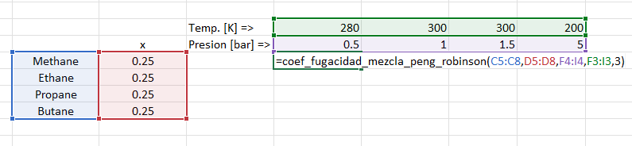 | 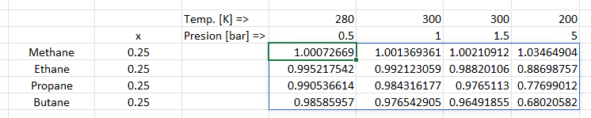 |

## coef_fugacidad_mezcla_soave

> **coef_fugacidad_mezcla_soave(compuestos, composiciones, presion, temperatura, raiz_volumen)**

Calcula los coeficientes de fugacidad ($\phi_i$) para cada componente en una mezcla utilizando la ecuación de estado de **Soave-Redlich-Kwong (SRK)**. Esta función permite evaluar la desviación del comportamiento ideal de los componentes en la fase seleccionada.

### Parámetros

* **compuestos:** Lista de celdas que contienen una referencia a los compuestos químicos de la mezcla.

* **composiciones:** Lista de celdas que contienen las fracciones molares de cada compuesto en la mezcla.

* **presion:** Celda o rango de celdas con la presión absoluta en **bar**.

* **temperatura:** Celda o rango de celdas con la temperatura en **Kelvin**.

* **raiz_volumen:** Número entero (1, 2 o 3) que selecciona la raíz del polinomio:
    * **1:** Raíz de menor volumen (Fase Líquida).
    * **2:** Raíz intermedia (Fase Metaestable).
    * **3:** Raíz de mayor volumen (Fase Vapor).
    * *Nota:* La ecuación normalmente devuelve tres raíces, pero puede devolver una única raíz de volumen. Si este es el caso y se selecciona una raíz diferente a la 1, la función no devolverá nada.

### Devuelve

* **Coeficientes de fugacidad:** Matriz con los valores de $\phi_i$ para cada compuesto en la mezcla.

### Ejemplo

| Entrada | Salida |
| :--- | :--- |
| 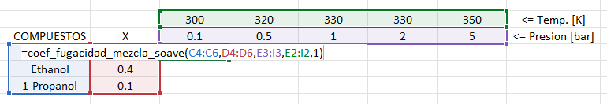 | 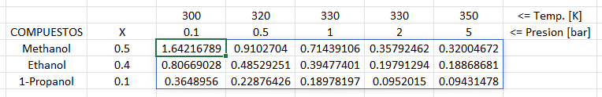 |

## coef_fugacidad_puro_peng_robinson

> **coef_fugacidad_puro_peng_robinson(compuestos, presion, temperatura, raiz_volumen)**

Calcula el coeficiente de fugacidad ($\phi$) para compuestos puros utilizando la ecuación de estado de **Peng-Robinson**. Esta función permite evaluar la desviación del comportamiento ideal de un compuesto individual en la fase seleccionada.

### Parámetros

* **compuestos:** Lista de celdas que contienen una referencia a los compuestos químicos.

* **presion:** Celda o rango de celdas con la presión absoluta en **bar**.

* **temperatura:** Celda o rango de celdas con la temperatura en **Kelvin**.

* **raiz_volumen:** Número entero (1, 2 o 3) que selecciona la raíz del polinomio:
    * **1:** Raíz de menor volumen (Fase Líquida).
    * **2:** Raíz intermedia (Fase Metaestable).
    * **3:** Raíz de mayor volumen (Fase Vapor).
    * *Nota:* La ecuación normalmente devuelve tres raíces, pero puede devolver una única raíz de volumen. Si este es el caso y se selecciona una raíz diferente a la 1, la función no devolverá nada.

### Devuelve

* **Coeficiente de fugacidad:** El valor de $\phi$ para cada compuesto puro bajo las condiciones especificadas.

### Ejemplo

| Entrada | Salida |
| :--- | :--- |
| 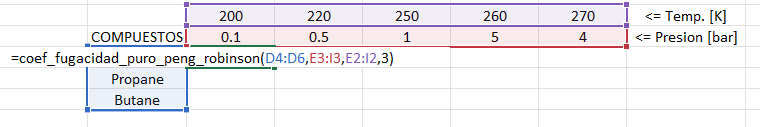 | 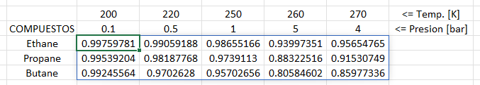 |

## coef_fugacidad_puro_soave

> **coef_fugacidad_puro_soave(compuestos, presion, temperatura, raiz_volumen)**

Calcula el coeficiente de fugacidad ($\phi$) para compuestos puros utilizando la ecuación de estado de **Soave-Redlich-Kwong (SRK)**. Esta función permite evaluar la desviación del comportamiento ideal de un compuesto individual en la fase seleccionada.

### Parámetros

* **compuestos:** Lista de celdas que contienen una referencia a los compuestos químicos.

* **presion:** Celda o rango de celdas con la presión absoluta en **bar**.

* **temperatura:** Celda o rango de celdas con la temperatura en **Kelvin**.

* **raiz_volumen:** Número entero (1, 2 o 3) que selecciona la raíz del polinomio:
    * **1:** Raíz de menor volumen (Fase Líquida).
    * **2:** Raíz intermedia (Fase Metaestable).
    * **3:** Raíz de mayor volumen (Fase Vapor).
    * *Nota:* La ecuación normalmente devuelve tres raíces, pero puede devolver una única raíz de volumen. Si este es el caso y se selecciona una raíz diferente a la 1, la función no devolverá nada.

### Devuelve

* **Coeficiente de fugacidad:** El valor de $\phi$ para cada compuesto puro bajo las condiciones especificadas.

### Ejemplo

| Entrada | Salida |
| :--- | :--- |
| 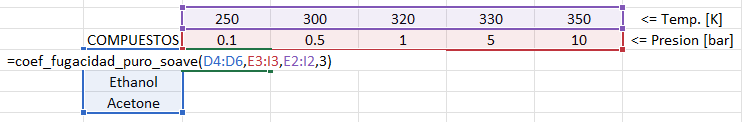 | 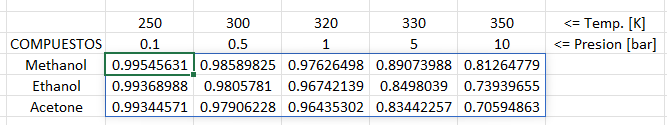 |

## unifac

> **unifac(composiciones, temperatura, num_grupos, r_mayus, q_mayus, a_ij)**

Calcula los coeficientes de actividad ($\gamma_i$) de cada compuesto en una mezcla líquida utilizando el modelo **UNIFAC**. Este modelo predice la no idealidad de la fase líquida basándose en las interacciones entre los grupos funcionales que constituyen las moléculas.

### Parámetros

* **composiciones:** Lista de celdas que contienen las fracciones molares de cada compuesto en la mezcla líquida.
* **temperatura:** Celda o rango de celdas con la temperatura en **Kelvin**.
* **num_grupos:** Matriz de tamaño ($C \times K$) que indica el número de instancias del grupo funcional $K$ en el compuesto $C$. 
    * *Formato estricto:* Las filas deben corresponder a los compuestos y las columnas a los grupos funcionales.
* **r_mayus:** Rango de celdas ($1 \times K$) con las constantes $R$ (volumen relativo) de cada grupo funcional.
* **q_mayus:** Rango de celdas ($1 \times K$) con las constantes $Q$ (área superficial relativa) de cada grupo funcional.
* **a_ij:** Matriz cuadrada ($K \times K$) de parámetros de interacción energética entre los grupos funcionales.

### Notas Importantes sobre el Formato

A diferencia de otras funciones de Excel Fundamental, los parámetros específicos del modelo UNIFAC (`num_grupos`, `r_mayus`, `q_mayus` y `a_ij`) **no admiten transposición**. Deben alimentarse a la función respetando rigurosamente su orientación de filas y columnas:
* **num_grupos:** Compuestos en filas, Grupos en columnas.
* **r_mayus / q_mayus:** Siempre en formato de fila (1 fila, K columnas).
* **a_ij:** Matriz de interacción donde la posición $(i, j)$ representa la interacción del grupo $i$ con el grupo $j$.

Los argumentos de `composiciones` y `temperatura` sí conservan la flexibilidad habitual para adaptarse a la disposición de los datos en la hoja de cálculo.

### Devuelve

* **Coeficientes de actividad:** Una matriz con los valores de $\gamma_i$ para cada compuesto a cada condición de temperatura especificada.

### Ejemplo

| Entrada | Salida |
| :--- | :--- |
| 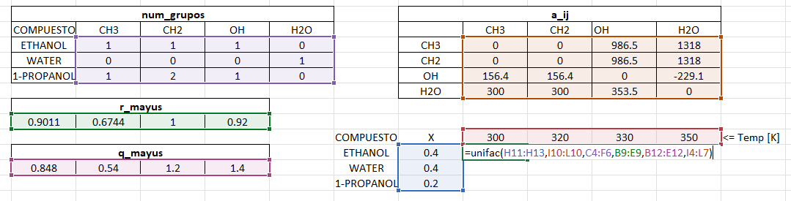 | 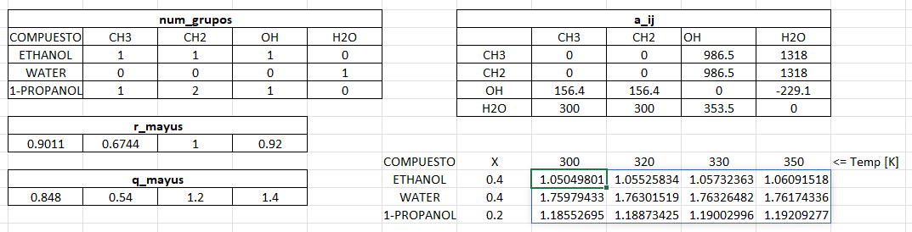 |

## poynting

> **poynting(compuestos, presion, temperatura)**

Calcula el **factor de Poynting**, el cual representa la corrección de la fugacidad de una fase líquida debido a la diferencia entre la presión del sistema y la presión de saturación del compuesto.

Matemáticamente, para un líquido incompresible, se define como:

$$\mathcal{P} = \exp \left( \frac{V_L (P - P_{sat})}{RT} \right)$$

Donde $V_L$ es el volumen molar del líquido, $P$ es la presión del sistema, $P_{sat}$ es la presión de saturación a la temperatura $T$, y $R$ es la constante de los gases.

### Parámetros

* **compuestos:** Lista de celdas que contienen una referencia a los compuestos químicos (ID, CAS, nombre IUPAC o común).

* **presion:** Celda o rango de celdas con la presión absoluta del sistema en **bar**.

* **temperatura:** Celda o rango de celdas con la temperatura del sistema en **Kelvin**.

### Devuelve

* **Factor de Poynting:** El valor adimensional resultante de la corrección por presión para cada compuesto.

### Ejemplo

| Entrada | Salida |
| :--- | :--- |
| 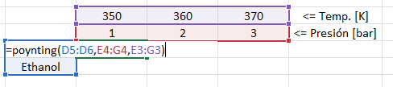 | 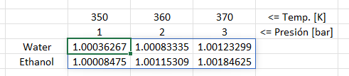 |

## entropia_ideal

> **entropia_ideal(compuestos, composiciones_liq, composiciones_vap, presion, temperatura, calidad_vapor)**

Calcula la entropía molar total de un sistema en equilibrio (o de una sola fase) bajo la suposición de comportamiento de gas ideal para la fase vapor y solución ideal para la fase líquida.

Matemáticamente, la entropía total del sistema se define como:

$$S_{total} = q \cdot S_{V} + (1 - q) \cdot S_{L}$$

Donde:
* $S_{V} = \sum y_i S_{i, V}(T, P) - R \sum y_i \ln y_i$ es la entropía de la mezcla gaseosa ideal.
* $S_{L} = \sum x_i S_{i, L}(T) - R \sum x_i \ln x_i$ es la entropía de la mezcla líquida ideal.
* $q$ es la calidad de vapor (fracción molar de vapor).

### Parámetros

* **compuestos:** Lista de celdas que contienen una referencia a los compuestos químicos (ID, CAS, nombre IUPAC o común).
* **composiciones_liq:** Lista de celdas con las fracciones molares de la fase líquida ($x_i$).
* **composiciones_vap:** Lista de celdas con las fracciones molares de la fase vapor ($y_i$).
* **presion:** Celda o rango de celdas con la presión absoluta en **bar**.
* **temperatura:** Celda o rango de celdas con la temperatura en **Kelvin**.
* **calidad_vapor:** Celda o rango de celdas con la fracción molar de vapor ($q$), con valores entre 0 y 1.

### Devuelve

* **Entropía ideal:** El valor de la entropía molar del sistema en **J/mol·K**.

### Ejemplo

| Entrada | Salida |
| :--- | :--- |
| 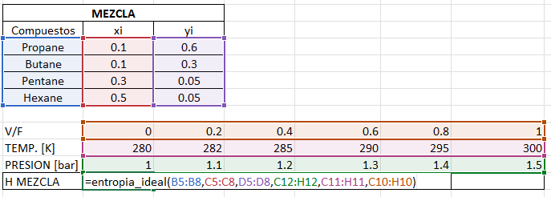 | 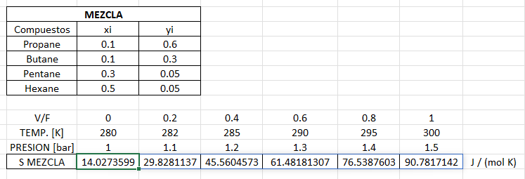 |

## entalpia_ideal

> **entalpia_ideal(compuestos, composiciones_liq, composiciones_vap, temperatura, calidad_vapor)**

Calcula la entalpía molar total de un sistema bajo las suposiciones de gas ideal para la fase vapor y solución ideal para la fase líquida. Bajo este modelo, la entalpía del sistema es independiente de la presión.

Matemáticamente, la entalpía total se define como:

$$H_{total} = q \cdot H_{V} + (1 - q) \cdot H_{L}$$

Donde:
* $H_{V} = \sum y_i H_{i, V}(T)$ es la entalpía de la mezcla gaseosa ideal.
* $H_{L} = \sum x_i H_{i, L}(T)$ es la entalpía de la mezcla líquida ideal.
* $q$ es la calidad de vapor (fracción molar de vapor).

### Parámetros

* **compuestos:** Lista de celdas que contienen una referencia a los compuestos químicos (ID, CAS, nombre IUPAC o común).
* **composiciones_liq:** Lista de celdas con las fracciones molares de la fase líquida ($x_i$).
* **composiciones_vap:** Lista de celdas con las fracciones molares de la fase vapor ($y_i$).
* **temperatura:** Celda o rango de celdas con la temperatura del sistema en **Kelvin**.
* **calidad_vapor:** Celda o rango de celdas con la fracción molar de vapor ($q$), con valores entre 0 y 1.

### Devuelve

* **Entalpía ideal:** El valor de la entalpía molar del sistema en **J/mol**.

### Ejemplo

| Entrada | Salida |
| :--- | :--- |
| 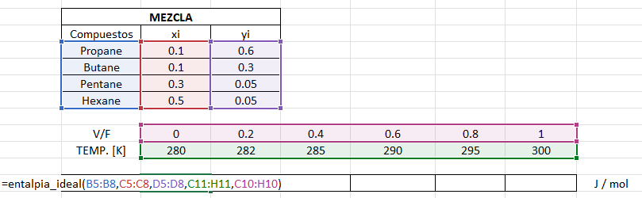 | 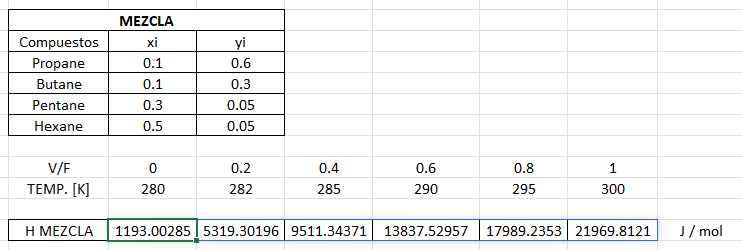 |

## entalpia_ideal_vapor

> **entalpia_ideal_vapor(compuestos, composiciones_vap, temperatura)**

Calcula la entalpía molar de una mezcla gaseosa bajo la suposición de comportamiento de gas ideal. En este modelo, la entalpía depende exclusivamente de la temperatura y de la composición de la mezcla.

Matemáticamente, se define como:

$$H_{V} = \sum y_i H_{i, V}(T)$$

Donde $H_{i, V}(T)$ es la entalpía molar del componente $i$ en estado de gas ideal a la temperatura $T$, y $y_i$ es su fracción molar en la fase vapor.

### Parámetros

* **compuestos:** Lista de celdas que contienen una referencia a los compuestos químicos (ID, CAS, nombre IUPAC o común).
* **composiciones_vap:** Lista de celdas con las fracciones molares de la fase vapor ($y_i$).
* **temperatura:** Celda o rango de celdas con la temperatura del sistema en **Kelvin**.

### Devuelve

* **Entalpía ideal del vapor:** El valor de la entalpía molar de la mezcla gaseosa en **J/mol**.

### Ejemplo

| Entrada | Salida |
| :--- | :--- |
| 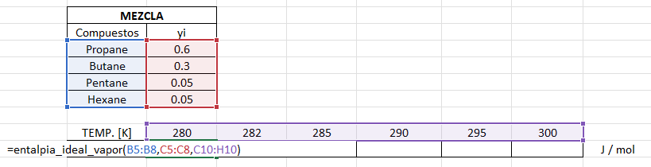 | 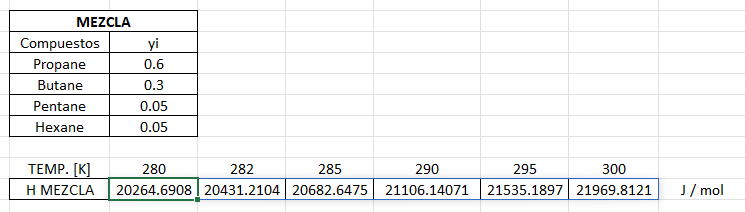 |
