# Tutorial de uso - Excel Fundamental 2.0
## Consideraciones
### Acerca de la base de datos
Las funciones de Excel fundamental requieren de propiedades termodinámicas. Estas se obtienen del Apéndice A del libro Properties of Gases and Liquids (5ta edición) (Poling, Prausnitz y O’Connell, 2001). Este apéndice recibe el nombre de *Data Bank*.

### Unidades
Excel Fundamental trabaja con unidades (Kelvin, bar, mol, Joule) para temperatura, presión absoluta, materia y energía respectivamente.

### ¿Cómo referenciar un compuesto químico?
Al momento de llamar una función de Excel Fundamental resulta necesario especificar que compuestos químicos están involucrados. Esto se puede hacer de 4 formas diferentes; ID, CAS, nombre IUPAC, nombre común.

|**Tipo de referencia**|**Explicación**|**Ejemplo**|
|:----------------:|:---------:|:-----:|
|**ID**|Número identificador que tiene asignado en el Data Bank|60
|**CAS**|Número único universal asignado por el Chemical Abstracts Service|64-19-7|
|**Nombre IUPAC**|Nombre del compuesto que sigue las reglas de IUPAC. (Ingles)|Ethanoic Acid|
|**Nombre común**|Nombre coloquial del compuesto. (Ingles)|Acetic Acid|

### ¿Cómo referenciar una propiedad termodinámica?
Referenciar una propiedad termodinámica solo resulta útil cuando se quiere buscar o modificar datos de la base de datos.
Se puede referenciar una propiedad termodinámica de dos formas: ID o nombre.

|**Tipo de referencia**|**Explicación**|**Ejemplo**|
|:--------------------:|:-------------:|:---------:|
|**Nombre**|Nombre de la propiedad termodinámica (existen muchos nombres para una sola propiedad)|Temperatura critica, Tc, Critical Temperature|
|**ID**|Posición de la propiedad en la base de datos|6|

## Documentación de funciones
En esta sección se muestra como usar todas las funciones disponibles en Excel Fundamental.

**Contenido**

**Funciones que acceden a la base de datos**
- [obtener](#obtener)
- [modificar_datos](#modificar_datos)

**Ecuaciónes cúbicas de estado**
- [van_der_waals](#van_der_waals)
- [redlich_kwong](#redlich_kwong)
- [soave](#soave)
- [peng_robinson](#peng_robinson)

**Propiedades termodinámicas**
- [antoine](#antoine)
- [cp](#cp)
- [integral_cp](#integral_cp)
- [integral_cp_entre_t](#integral_cp_entre_t)

**Fugacidad**
- [coef_fugacidad_mezcla_peng_robinson](#coef_fugacidad_mezcla_peng_robinson)
- [coef_fugacidad_mezcla_soave](#coef_fugacidad_mezcla_soave)
- [coef_fugacidad_puro_peng_robinson](#coef_fugacidad_puro_peng_robinson)
- [coef_fugacidad_puro_soave](#coef_fugacidad_puro_soave)

**Modelos de actividad**
- [unifac](#unifac)

**Correcciones y propiedades energéticas**
- [poynting](#poynting)
- [entropia_ideal](#entropia_ideal)
- [entalpia_ideal](#entalpia_ideal)
- [entalpia_ideal_vapor](#entalpia_ideal_vapor)

## obtener

> **obtener(compuestos, propiedades)**

Busca propiedades termodinámicas en la base de datos y las imprime como tabla de Excel.

### Parámetros:

* **compuestos:** Lista de celdas que contienen una referencia a un compuesto químico.
* **propiedades:** Lista de celdas que contienen una referencia a una propiedad termodinámica.

### Devuelve:

* **tabla de propiedades:** Tabla que contiene las propiedades seleccionadas de los compuestos seleccionados.

### Ejemplo:

| Entrada | Salida |
| :--- | :--- |
| 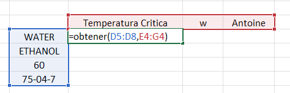 | 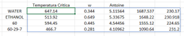 |

## modificar_datos

>**modificar_datos(compuestos, propiedades, valores)**

Modifica temporalmente los valores de la base de datos.

### Parámetros

* **compuestos:** Lista de celdas que contienen una referencia a un compuesto químico.
* **propiedades:** Lista de celdas que contienen una referencia a una propiedad termodinámica.
* **valores:** Matriz de celdas que contienen los nuevos valores que se asignaran a cada compuesto para cada propiedad termodinámica.

### Devuelve

* **Texto:** La cadena "Datos Añadidos". Solo se muetra cuando se modifica la base exitosamente.

### Ejemplo

| Entrada | Salida |
| :--- | :--- |
| 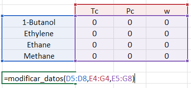 | 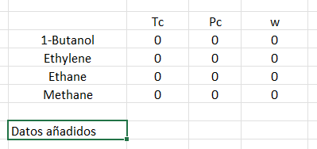 |

## van_der_waals

>**van_der_waals(compuestos, composiciones, presion, temperatura, volumen, raw)**

Calcula la variable termodinámica faltante (P, T o V) utilizando la ecuación de estado de Van der Waals para una mezcla. Si se proporcionan las tres variables, la función actúa como un validador que evalúa si la relación se cumple o calcula el error relativo entre ellas.

### Parámetros

* **compuestos:** Lista de celdas que contienen una referencia a los compuestos químicos de la mezcla.

* **composiciones:** Lista de celdas que contienen las fracciones molares de cada compuesto en la mezcla

* **presion:** (Opcional) Celda o rango de celdas con la presión absoluta en **bar**

* **temperatura:** (Opcional) Celda o rango de celdas con la temperatura en **Kelvin**

* **volumen:** (Opcional) Celda o rango de celdas con el volumen molar en **mL/mol**

### Devuelve

* **Variable calculada:** Si se omitió una variable (P, V, T), devuelve su valor calculandolo con la ecuación de Van der Waals.

* **Validación / Error relativo:** Si se especificaron todas las variables, devuelve `True / False` dependiendo si esas varaibles satisfacen la ecuacion de estado de Van der Waals.

### Ejemplo 1 - Calculo de volumen molar

| Entrada | Salida |
| :--- | :--- |
| 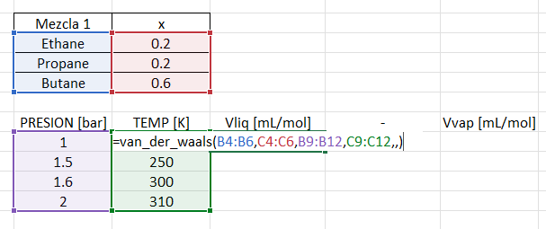 | 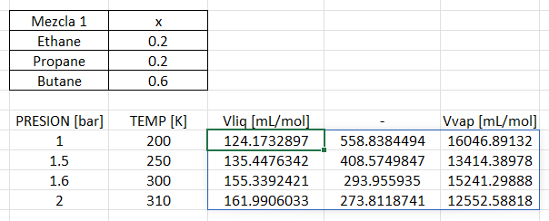 |

**Nota:** Es importante notar que cuando no se especifica el volumen al llamar la funcion, aun asi se coloca su respectiva coma.
> van_der_waals(compuestos, composiciones, presion, temperatura,   )

### Ejemplo 2 - Calculo de presión

| Entrada | Salida |
| :--- | :--- |
| 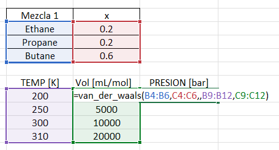 | 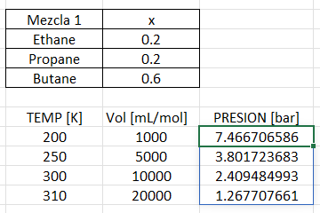 |

### Ejemplo 3 - Calculo de temperatura

| Entrada | Salida |
| :--- | :--- |
| 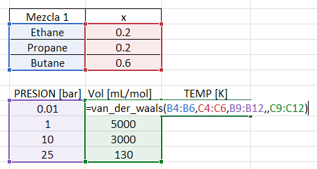 | 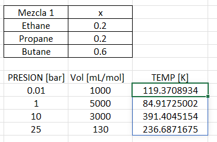 |

### Ejemplo 4 - Se especifican las tres variabes P, V, T.

| Entrada | Salida |
| :--- | :--- |
| 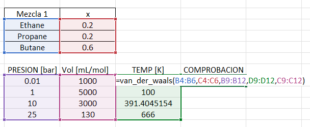 | 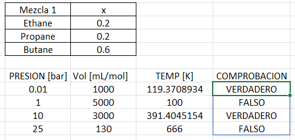 |

## redlich_kwong

> **redlich_kwong(compuestos, composiciones, presion, temperatura, volumen)**

Calcula la variable termodinámica faltante (P, T o V) utilizando la ecuación de estado de **Redlich-Kwong** para una mezcla. Si se proporcionan las tres variables, la función actúa como un validador que evalúa si la relación se cumple o calcula el error relativo entre ellas.

### Parámetros

* **compuestos:** Lista de celdas que contienen una referencia a los compuestos químicos de la mezcla.

* **composiciones:** Lista de celdas que contienen las fracciones molares de cada compuesto en la mezcla.

* **presion:** (Opcional) Celda o rango de celdas con la presión absoluta en **bar**.

* **temperatura:** (Opcional) Celda o rango de celdas con la temperatura en **Kelvin**.

* **volumen:** (Opcional) Celda o rango de celdas con el volumen molar en **mL/mol**.

### Devuelve

* **Variable calculada:** Si se omitió una variable (P, V, T), devuelve su valor calculándolo con la ecuación de Redlich-Kwong.

* **Validación / Error relativo:** Si se especificaron todas las variables, devuelve `True / False` dependiendo de si esas variables satisfacen la ecuación de estado.

### Ejemplo 1 - Cálculo de volumen molar

| Entrada | Salida |
| :--- | :--- |
| 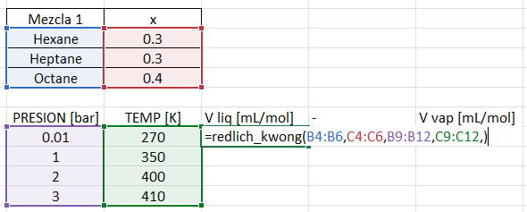 | 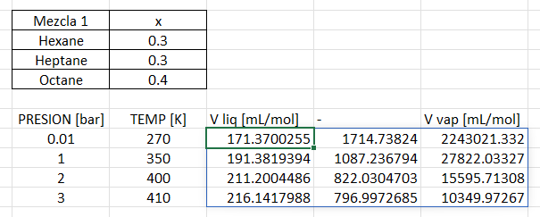 |

**Nota:** Es importante notar que cuando no se especifica el volumen al llamar la función, aun así se coloca su respectiva coma.
> redlich_kwong(compuestos, composiciones, presion, temperatura,   )

### Ejemplo 2 - Cálculo de presión

| Entrada | Salida |
| :--- | :--- |
| 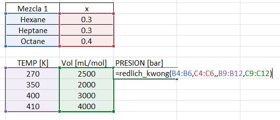 | 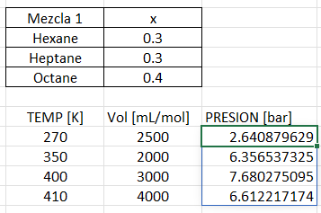 |

### Ejemplo 3 - Cálculo de temperatura

| Entrada | Salida |
| :--- | :--- |
| 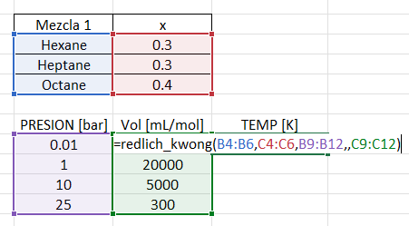 | 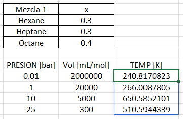 |

### Ejemplo 4 - Se especifican las tres variables P, V, T.

| Entrada | Salida |
| :--- | :--- |
| 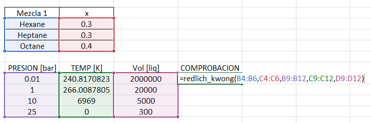 | 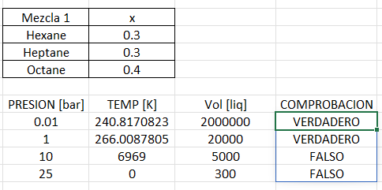 |

## soave

> **soave(compuestos, composiciones, presion, temperatura, volumen)**

Calcula la variable termodinámica faltante (P, T o V) utilizando la ecuación de estado de **Soave-Redlich-Kwong (SRK)** para una mezcla. Si se proporcionan las tres variables, la función actúa como un validador que evalúa si la relación se cumple o calcula el error relativo entre ellas.

### Parámetros

* **compuestos:** Lista de celdas que contienen una referencia a los compuestos químicos de la mezcla.

* **composiciones:** Lista de celdas que contienen las fracciones molares de cada compuesto en la mezcla.

* **presion:** (Opcional) Celda o rango de celdas con la presión absoluta en **bar**.

* **temperatura:** (Opcional) Celda o rango de celdas con la temperatura en **Kelvin**.

* **volumen:** (Opcional) Celda o rango de celdas con el volumen molar en **mL/mol**.

### Devuelve

* **Variable calculada:** Si se omitió una variable (P, V, T), devuelve su valor calculándolo con la ecuación de Soave.

* **Validación / Error relativo:** Si se especificaron todas las variables, devuelve el error relativo (como valor numérico) al verificar la consistencia de los datos ingresados.

### Ejemplo 1 - Cálculo de volumen molar

| Entrada | Salida |
| :--- | :--- |
| 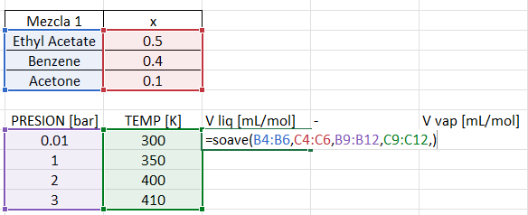 | 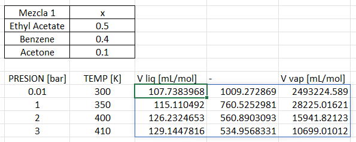 |

**Nota:** Es importante notar que cuando no se especifica el volumen al llamar la función, aun así se coloca su respectiva coma.
> soave(compuestos, composiciones, presion, temperatura,   )

### Ejemplo 2 - Cálculo de presión

| Entrada | Salida |
| :--- | :--- |
| 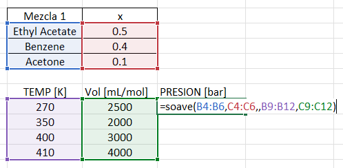 | 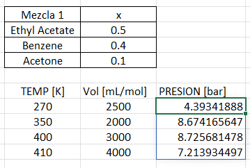 |

### Ejemplo 3 - Cálculo de temperatura

| Entrada | Salida |
| :--- | :--- |
| 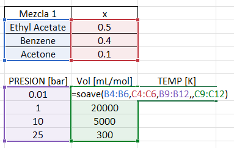 | 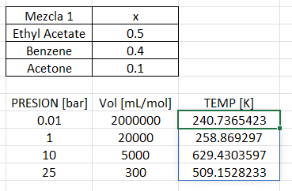 |

### Ejemplo 4 - Se especifican las tres variables P, V, T.

| Entrada | Salida |
| :--- | :--- |
| 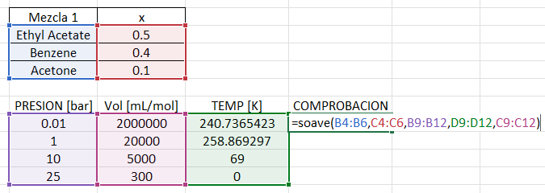 | 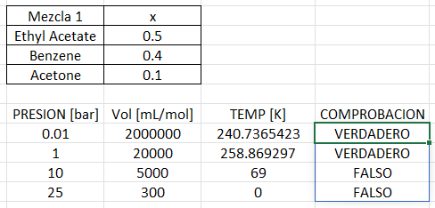 |

## peng_robinson

> **peng_robinson(compuestos, composiciones, presion, temperatura, volumen)**

Calcula la variable termodinámica faltante (P, T o V) utilizando la ecuación de estado de **Peng-Robinson** para una mezcla. Si se proporcionan las tres variables, la función actúa como un validador que evalúa si la relación se cumple o calcula el error relativo entre ellas.

### Parámetros

* **compuestos:** Lista de celdas que contienen una referencia a los compuestos químicos de la mezcla.

* **composiciones:** Lista de celdas que contienen las fracciones molares de cada compuesto en la mezcla.

* **presion:** (Opcional) Celda o rango de celdas con la presión absoluta en **bar**.

* **temperatura:** (Opcional) Celda o rango de celdas con la temperatura en **Kelvin**.

* **volumen:** (Opcional) Celda o rango de celdas con el volumen molar en **mL/mol**.

### Devuelve

* **Variable calculada:** Si se omitió una variable (P, V, T), devuelve su valor calculándolo con la ecuación de Peng-Robinson.

* **Validación / Error relativo:** Si se especificaron todas las variables, devuelve el error relativo (como valor numérico) al verificar la consistencia de los datos ingresados.

### Ejemplo 1 - Cálculo de volumen molar

| Entrada | Salida |
| :--- | :--- |
| 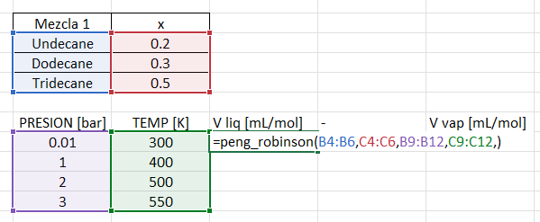 | 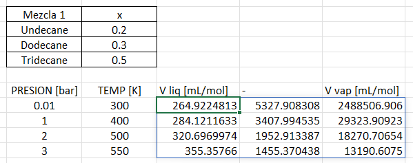 |

**Nota:** Es importante notar que cuando no se especifica el volumen al llamar la función, aun así se coloca su respectiva coma.
> peng_robinson(compuestos, composiciones, presion, temperatura,   )

### Ejemplo 2 - Cálculo de presión

| Entrada | Salida |
| :--- | :--- |
| 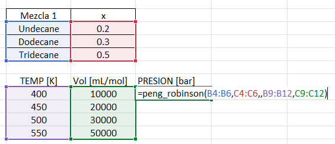 | 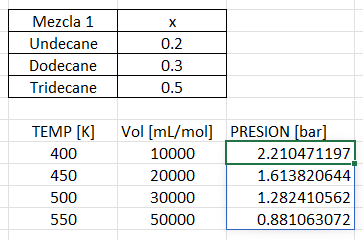 |

### Ejemplo 3 - Cálculo de temperatura

| Entrada | Salida |
| :--- | :--- |
| 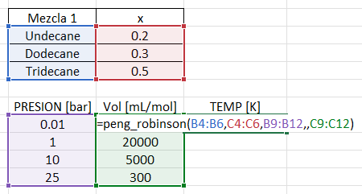 | 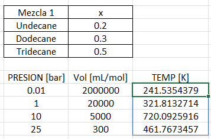 |

### Ejemplo 4 - Se especifican las tres variables P, V, T.

| Entrada | Salida |
| :--- | :--- |
| 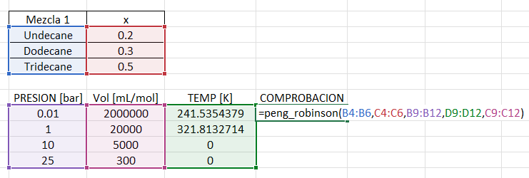 | 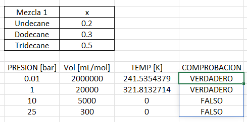 |

## antoine

> **antoine(compuestos, presion, temperatura, raw)**

Calcula la presión de saturación ($P_{sat}$) o la temperatura de saturación ($T_{sat}$) utilizando la ecuación de Antoine. Esta función es matricial, permitiendo realizar cálculos para múltiples compuestos y condiciones simultáneamente. 

### Parámetros

* **compuestos:** Lista de celdas que contienen una referencia a los compuestos químicos (ID, CAS, nombre IUPAC o común).

* **presion:** (Opcional) Celda o rango de celdas con la presión absoluta en **bar**.

* **temperatura:** (Opcional) Celda o rango de celdas con la temperatura en **Kelvin**.

* **raw:** (Opcional) Valor booleano. Por defecto es `True`. 
    * Si es `True`, la función realiza el cálculo directamente. 
    * Si es `False`, la función verifica si las condiciones de entrada están dentro del rango de temperatura o presión reportado en el *Data Bank*. Si los valores están fuera de rango, la función devolverá una advertencia en lugar del cálculo. 
    * Para este argumento **NO** es necesario incluir sus respectivas comas al llamar la funcion

### Devuelve

* **Variable calculada:** El valor de la presión de saturación o temperatura de saturación según el argumento omitido.

### Ejemplo 1 - Cálculo de presión de saturación ($P_{sat}$)

| Entrada | Salida |
| :--- | :--- |
| 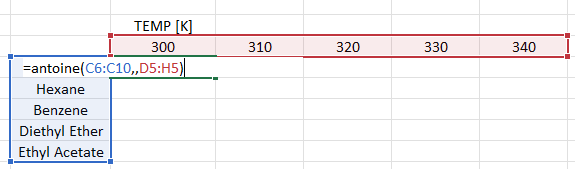 | 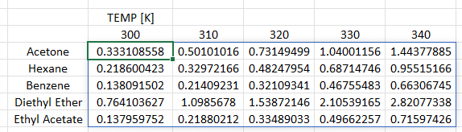 |

**Nota:** Es importante notar que cuando se omite la presión para calcularla, se debe respetar el espacio del argumento mediante la coma.
> antoine(compuestos,  , temperatura)

### Ejemplo 2 - Cálculo de temperatura de saturación ($T_{sat}$)

| Entrada | Salida |
| :--- | :--- |
| 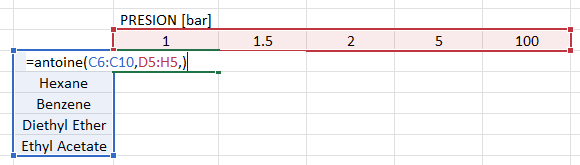 | 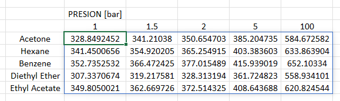 |

### Ejemplo 3 - Uso del parámetro `raw`. 

| Entrada | Salida |
| :--- | :--- |
| 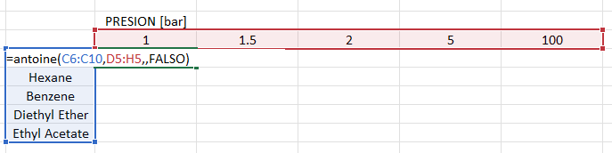 | 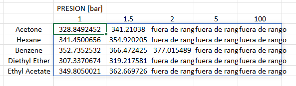 |

## cp

> **cp(compuestos, temperatura, valor_cp, raw)**

Calcula la capacidad calorífica a presión constante ($C_p$) para un gas ideal a una temperatura dada, o determina la temperatura necesaria para alcanzar un valor de $C_p$ específico. Al ser una función matricial, permite procesar múltiples compuestos y condiciones simultáneamente.

### Parámetros

* **compuestos:** Lista de celdas que contienen una referencia a los compuestos químicos (ID, CAS, nombre IUPAC o común).

* **temperatura:** (Opcional) Celda o rango de celdas con la temperatura en **Kelvin**.

* **valor_cp:** (Opcional) Celda o rango de celdas con el valor de la capacidad calorífica en **J/mol·K**.

* **raw:** (Opcional) Valor booleano. Por defecto es `True`. 
    * Si es `True`, la función realiza el cálculo directamente usando las constantes del *Data Bank*. 
    * Si es `False`, la función verifica si la temperatura se encuentra dentro del rango de validez reportado para el modelo polinomial. Si está fuera de rango, devolverá una advertencia.
    * A diferencia de los argumentos de `temperatura` o `valor_cp`, para el argumento `raw` no es necesario incluir comas adicionales.

### Devuelve

* **Variable calculada:** El valor de $C_p$ o de la Temperatura según el argumento que se haya omitido en la llamada.

### Ejemplo 1 - Cálculo de capacidad calorífica ($C_p$)

| Entrada | Salida |
| :--- | :--- |
| 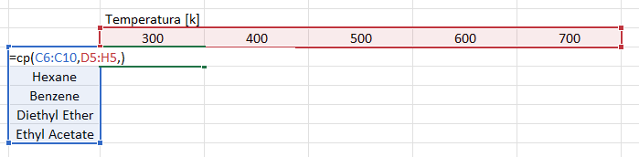 | 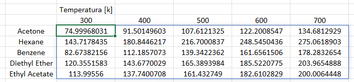 |

**Nota:** Para calcular el $C_p$, se debe dejar el espacio del tercer argumento vacío respetando la coma.
> cp(compuestos, temperatura,  )

### Ejemplo 2 - Cálculo de temperatura ($T$)

| Entrada | Salida |
| :--- | :--- |
| 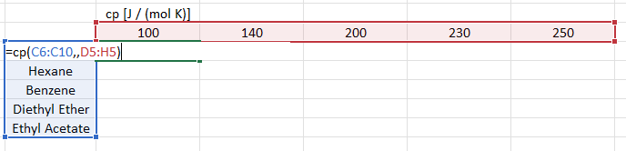 | 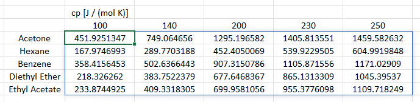 |

**Nota:** Para calcular la temperatura, se debe dejar el espacio del segundo argumento vacío respetando la coma.
> cp(compuestos,  , valor_cp)

### Ejemplo 3 - Uso del parámetro `raw`

| Entrada | Salida |
| :--- | :--- |
| 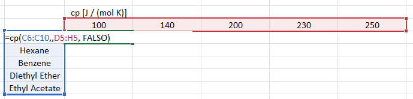 | 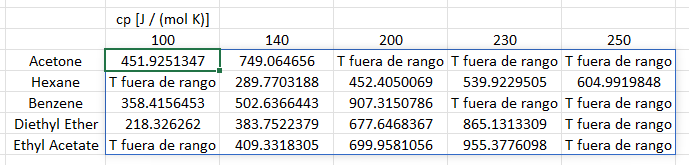 |

## integral_cp

> **integral_cp(compuestos, temperatura_1, temperatura_2, valor_int, raw)**

Calcula la integral de la capacidad calorífica a presión constante ($\int_{T_1}^{T_2} C_p dT$) para un gas ideal entre dos temperaturas dadas. Esta función permite resolver para el valor de la integral o para cualquiera de las dos temperaturas ($T_1$ o $T_2$) si se dejan como incógnitas.

### Parámetros

* **compuestos:** Lista de celdas que contienen una referencia a los compuestos químicos (ID, CAS, nombre IUPAC o común).

* **temperatura_1:** (Opcional) Celda o rango de celdas con la temperatura inicial en **Kelvin**.

* **temperatura_2:** (Opcional) Celda o rango de celdas con la temperatura final en **Kelvin**.

* **valor_int:** (Opcional) Celda o rango de celdas con el valor de la integral de capacidad calorífica en **J/mol**.

* **raw:** (Opcional) Valor booleano. Por defecto es `True`. 
    * Si es `True`, la función realiza el cálculo directamente. 
    * Si es `False`, la función verifica si las temperaturas se encuentran dentro del rango de validez reportado en el *Data Bank*. 
    * A diferencia de los argumentos de temperatura o el valor de la integral, para el argumento `raw` no es necesario incluir comas adicionales.

### Devuelve

* **Variable calculada:** El valor de la integral, la temperatura inicial ($T_1$) o la temperatura final ($T_2$), según el argumento que se haya omitido en la llamada.

### Ejemplo 1 - Cálculo del valor de la integral

| Entrada | Salida |
| :--- | :--- |
| 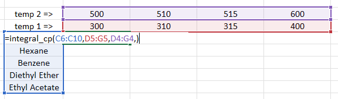 | 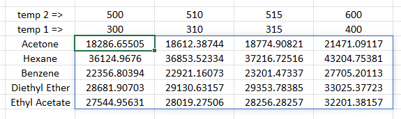 |

**Nota:** Para calcular el valor de la integral, se debe dejar el espacio del cuarto argumento vacío respetando la coma.
> integral_cp(compuestos, temperatura_1, temperatura_2,  )

### Ejemplo 2 - Cálculo de temperatura ($T_2$)

| Entrada | Salida |
| :--- | :--- |
|  |  |

**Nota:** Para calcular una temperatura (incógnita), se debe dejar su espacio vacío respetando la coma correspondiente.
> integral_cp(compuestos, temperatura_1,  , valor_int)

### Ejemplo 3 - Uso del parámetro `raw`

| Entrada | Salida |
| :--- | :--- |
|  |  |

## integral_cp_entre_t

> **integral_cp_entre_t(compuestos, temperatura_1, temperatura_2, valor_int, raw)**

Calcula la integral de la capacidad calorífica dividida entre la temperatura ($\int_{T_1}^{T_2} \frac{C_p}{T} dT$) para un gas ideal. Esta función es fundamental para cálculos de cambio de entropía y permite resolver tanto el valor de la integral como cualquiera de las temperaturas límites ($T_1$ o $T_2$) si se dejan como incógnitas.

### Parámetros

* **compuestos:** Lista de celdas que contienen una referencia a los compuestos químicos (ID, CAS, nombre IUPAC o común).

* **temperatura_1:** (Opcional) Celda o rango de celdas con la temperatura inicial en **Kelvin**.

* **temperatura_2:** (Opcional) Celda o rango de celdas con la temperatura final en **Kelvin**.

* **valor_int:** (Opcional) Celda o rango de celdas con el valor de la integral ($\int \frac{C_p}{T} dT$) en **J/mol·K**.

* **raw:** (Opcional) Valor booleano. Por defecto es `True`. 
    * Si es `True`, la función realiza el cálculo directamente. 
    * Si es `False`, la función verifica si las temperaturas se encuentran dentro del rango de validez reportado en el *Data Bank*. 
    * A diferencia de los argumentos de temperatura o el valor de la integral, para el argumento `raw` no es necesario incluir comas adicionales.

### Devuelve

* **Variable calculada:** El valor de la integral, la temperatura inicial ($T_1$) o la temperatura final ($T_2$), según el argumento que se haya omitido en la llamada.

### Ejemplo 1 - Cálculo del valor de la integral

| Entrada | Salida |
| :--- | :--- |
|  |  |

**Nota:** Para calcular el valor de la integral, se debe dejar el espacio del cuarto argumento vacío respetando la coma.
> integral_cp_entre_t(compuestos, temperatura_1, temperatura_2,  )

### Ejemplo 2 - Cálculo de temperatura ($T_2$)

| Entrada | Salida |
| :--- | :--- |
|  |  |

**Nota:** Para calcular una temperatura (incógnita), se debe dejar su espacio vacío respetando la coma correspondiente.
> integral_cp_entre_t(compuestos, temperatura_1,  , valor_int)

### Ejemplo 3 - Uso del parámetro `raw`

| Entrada | Salida |
| :--- | :--- |
|  |  |

## coef_fugacidad_mezcla_peng_robinson
## coef_fugacidad_mezcla_soave
## coef_fugacidad_puro_peng_robinson
## coef_fugacidad_puro_soave
## unifac
## poynting
## entropia_ideal
## entalpia_ideal
## entalpia_ideal_vapor

